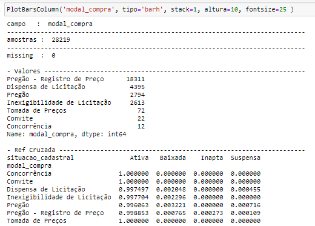
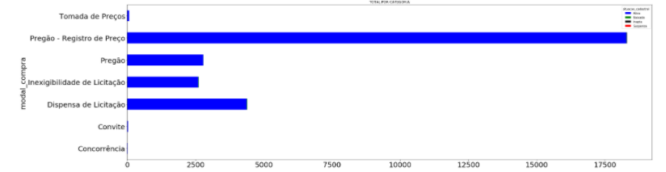

# Análise dos Vencedores de Licitações Públicas por Agrupamento

https://github.com/glaucopr/analise-licitacoes/

#### Aluno: Glauco Pires Rabello (glaucorabello@gmail.com) 
#### Orientador: Felipe Borges (felipe.borges@ele.puc-rio.br)

--------------

### BI MASTER - Business Inteligence Master - Projeto Final - Maio 2021
#### Pré-requisito para conclusão de curso e obtenção de crédito na disciplina "Projetos de Sistemas Inteligentes de Apoio à Decisão". (https://ica.puc-rio.ai/bi-master)

--------------

### Sumário
Estudar o comportamento e identificar padrões da base pública dos vencedores das licitações públicas, apontar suas similaridades e eventuais outliers.
Foi construída uma base informacional, carregando os arquivos disponibilizados nestas bases públicas, realizando mais tratamentos para transformações informacionais e utilizando em seguida para as devidas análises utilizando ferramentas de Data Mining.   

#### Arquivos Públicos
1. Portal da Transparência ( http://www.portaltransparencia.gov.br/download-de-dados )
2. Dados públicos de CNPJ ( https://www.receita.economia.gov.br/orientacao/tributaria/cadastros/cadastro-nacional-de-pessoas-juridicas-cnpj/dados-publicos-cnpj )
3. Dados Abertos ( https://dados.gov.br/ )

------------------------
### Estruturação Informacional
Foram baixados dos site mencionados e carregados os seguintes arquivos para construção de uma base de amostras para executar os testes.

#### Licitações 
    • ItemLicitação ; lista dos vencedores por licitação
    • Licitações  ; lista de participantes por licitação
      
#### Sanções
    • Empresas Inidoneas
    • Empresas Impedidas
    • Empresas Punidas
    • Acordo Leniencia

#### Receita Federal
    • Base completa de CNPJ – referencia nov/2020
    • Dominios: Motivo Situação Cadastral, CNAE e qualificação sócio representante

obs: O período de referencias das informações extraídas foi de janeiro/2020

------------------------------
### Preparação

Para este trabalho foram carregados bases grandes, eventualmente foi necessário reduzir o volume , retirando Pessoas Físicas da analise e reduzindo a mostra em apenas um unico mês de referência.

Foi criado um arquivo com estes dados tratados:  amostra_cnpj_202001.zip 

-----------------------------
### Análise Exploratória
Nesta etapa, já com os dados carregados no banco de dados, foi realizado fase uma análise inicial para identificar quais dados poderiam ser aproveitadas nas análises seguintes. 
- Códigos contidos no arquivo 1-licitacoes_cnpj_analise_exploratoria.ipynb

Com os dados disponíveis foi iniciada a modelagem  para a identificação de possíveis similaridades.

-----------------------
### Conclusões Finais 
Identificados clusters atraves de similaridades por Modalidades de Compra.

Caso selecionamos outra modalidade ( ou adicionar outros filtros ) o resultado gerado pode ser diferente. Nestes casos sempre serão necessários a reparametrização diferente no DBSCAN.

Conseguimos demonstrar que a clusterização é viável com as variáveis disponíveis neste dataset publico e realizar a segmentação com as similaridades descobertas. 

Sempre que houver alguma necessidade adicional o algortimo pode ser reexecutado diversas vezes , com novos parametros para melhorar mais o resultado. Haverá um custo de processamento maior se a quantidade de amostras do dataset for maior e na quantidade de iterações necessárias para comparação dos resultados.
 
Ainda foi percebido que a análise pode ter continuidade, adicionando mais variáveis e um dataset maior para que possa melhorar a qualidade dos resultados e reduzindo outliers. Ainda posteriormente pode-se adicionar outros métodos supervisionados de análise para previsão com novas entradas de dados.

  
### Bibliografia

### Anexos
#### Dicionario de Dados
+---------------------+--------------+-----------------------------------------+
| Field               | Type         | Descricao                               |
+---------------------+--------------+-----------------------------------------+
| mesref              | char(6)      | mes de referencia da licitacao          |
| num_licitacao       | varchar(255) | Número que identifica a licitação SIASG |
| cod_ug              | varchar(255) | Número do processo da licitação         |
| dat_resultado       | date         | data do resultado                       |
| modal_compra        | varchar(255) | modalidade de compra na licitacao       |
| objeto              | text         | objeto da licitacao                     |
| cnpj                | varchar(255) | cnpj do licitante vencedor              |
| tipo_pessoa         | varchar(2)   | tipo de pessoa NO                       |
| ind_matriz          | char(1)      | indicador matriz ou filial              |
| razao_social        | varchar(150) | razao social do licitante               |
| situacao_cadastral  | varchar(8)   | descricao situacao cadastral            |
| dat_sit_cadastral   | date         | data situacao cadastral                 |
| ano_sit_cadastral   | int(4)       | ano situacao cadastral                  |
| motiv_sit_cadastral | varchar(255) | motivo situacaocadastral se nao ativa   |
| tipo_nat_juridica   | varchar(255) | tipo nat juridica                       |
| dat_ini_ativ        | date         | data inicio atividade                   |
| ano_ini_ativ        | int(4)       | ano inicio atividade                    |
| qualif_resp         | varchar(255) | qualificacao do responsavel da empresa  |
| setor_cnae          | varchar(255) | setor cadastro CNAE                     |
| porte_empr          | varchar(13)  | porte empresarial                       |
| opt_simples         | varchar(11)  | optante pelo simples                    |
| motiv_impedimento   | varchar(255) | motivo de eventual impedimento          |
| motiv_punicao       | varchar(255) | motivo punicao                          |
| motiv_inidonea      | varchar(255) | motivo inidonea                         |  
+---------------------+--------------+-----------------------------------------+

  
