# Análise dos Vencedores de Licitações Públicas por Agrupamento

#### Aluno: Glauco Pires Rabello (glaucorabello@gmail.com) 
#### Orientador: Felipe Borges (prof.felipe@ica.ele.puc-rio.br)

- [Link para o código](https://github.com/glaucopr/analise-licitacoes/)
 
--------------

### BI MASTER - Business Inteligence Master - Projeto Final - Maio 2021
#### Pré-requisito para conclusão de curso e obtenção de crédito na disciplina "Projetos de Sistemas Inteligentes de Apoio à Decisão". (https://ica.puc-rio.ai/bi-master)

--------------

### Sumário
Estudar o comportamento e identificar padrões da base pública dos vencedores das licitações públicas, apontar suas similaridades e eventuais outliers.
Foi construída uma base informacional, carregando os arquivos disponibilizados nestas bases públicas, realizando mais tratamentos para transformações informacionais e utilizando em seguida para as devidas análises utilizando ferramentas de Data Mining.   

------------------------
### Estruturação Informacional
Foram baixados do sítio de Portal da Transparência e Dados Abertos e carregados no banco de dados os seguintes arquivos para construção de uma base de amostras para executar analises.

#### Licitações 
    • ItemLicitação ; lista dos vencedores por licitação
    • Licitações  ; lista de participantes por licitação
      
#### Sanções
    • Empresas Inidoneas
    • Empresas Impedidas
    • Empresas Punidas
    • Acordo Leniencia

#### Receita Federal
    • Base completa de CNPJ – referencia nov/2020
    • Dominios: Motivo Situação Cadastral, CNAE e qualificação sócio representante

obs: O período de referencia das informações extraídas é de janeiro/2020

------------------------------
### Preparação de Dados

Como para este estudo foi necessário carregar grande volume de dados, próprias destas informações, foi necessário reduzir o volume de registros, retirando Pessoas Físicas da analise e reduzindo a amostra em apenas um unico mês de referência.

Uma cópia dos dados tratados estão disponíveis no arquivo amostra_cnpj.zip 

-----------------------------
### Análise Exploratória
Nesta etapa, já com os dados prontos no banco de dados, foi realizado fase uma análise inicial exploratória para identificar quais dados poderiam ser aproveitadas nas etapas  seguintes. 
- Códigos contidos no arquivo *1-licitacoes_cnpj_analise_exploratoria.ipynb*

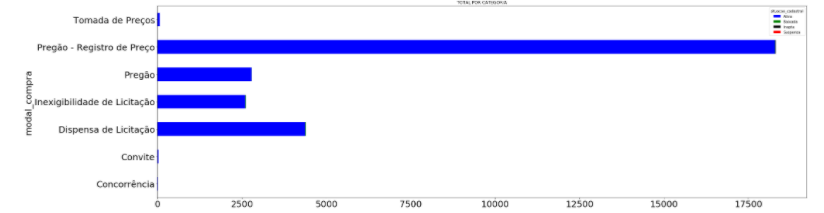

A seguir foi iniciada a modelagem para a identificação de possíveis similaridades.

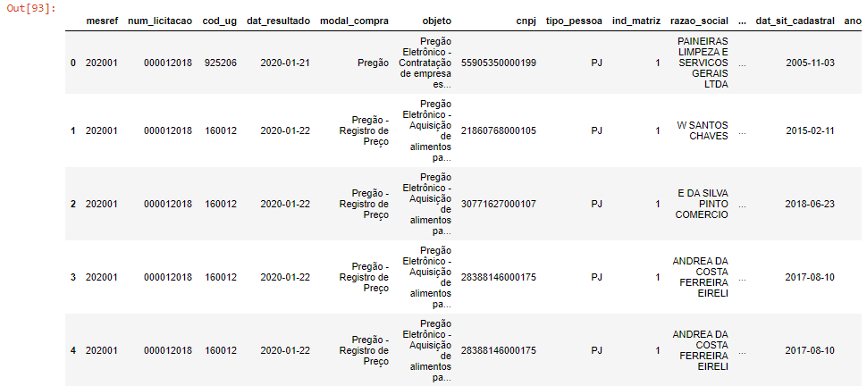

----------------------------
### Análise variável ‘Modalidade de Compras’
Como esta variável é uma das mais importantes do dataset, pois é a que define o motivo da licitação, foi realizado um teste neste dataset mantendo esta informação para verificação.

No processo de construção de modelo, para melhor analise foram convertidas as váriaveis categóricas em numéricas por Encoding e depois aplicando o método de PCA.

Nesta etapa descobrimos algumas variáveis que poderão definir este modelo. ( foi escolhido 80% para explicar esses dados )

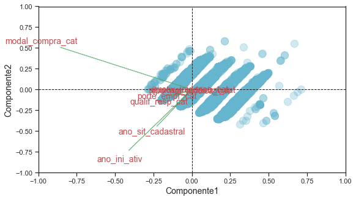

####Teste com método K-Means
Este teste foi gerado para identificar se seria possível usá-lo, pois é um método popular e de fácil implantação. Desta maneira verificamos o K pela inércia do modelo e em seguida analisando se o modelo gerado trará bons resultados.
Após a execução do K-Means, visualmente chegamos a este resultado que pode ser facilmente interpretado como um método ruim para este dataset.

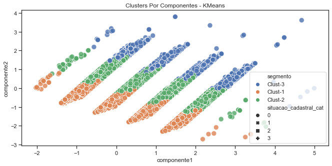

### Algoritmo DBSCAN

Escolha deste método por não ter uma quantidade de clusters pré-definidos e podemos encontrar quase toda as formas. 

Através de algumas inferências podemos escolher as parametrizações melhores.

Ja identificamos um ótimo resultado desde já. 

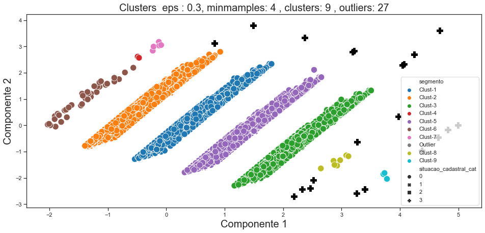

Uma reparametrização no algoritmo pode servir melhorar este resultado através de um ajuste fino. Observando que é necessário equilibrar a quantidade de clusters e outliers e as frequências individuais dos clusters.

Alguns outliers gerados foram identificados desta maneira, pois estavam contidos em uma faixa com poucas amostras. Estes outliers também poderiam ser identificados como um pequeno cluster rotulado. 

Conforme figura abaixo, podemos questionar a parametrização do modelo e realizar ajustes.

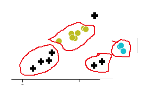

A variável ano_ini_atividade tambem ajudou na identificação de alguns outliers, mas com pontos mais isolados.

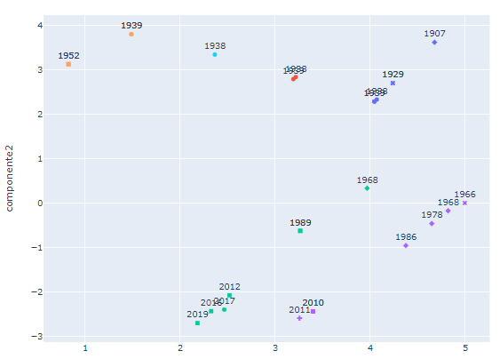

Assim concluímos que os clusters identificados se encaixam “exatamente” com as amostras de Modalidade de Compras. 

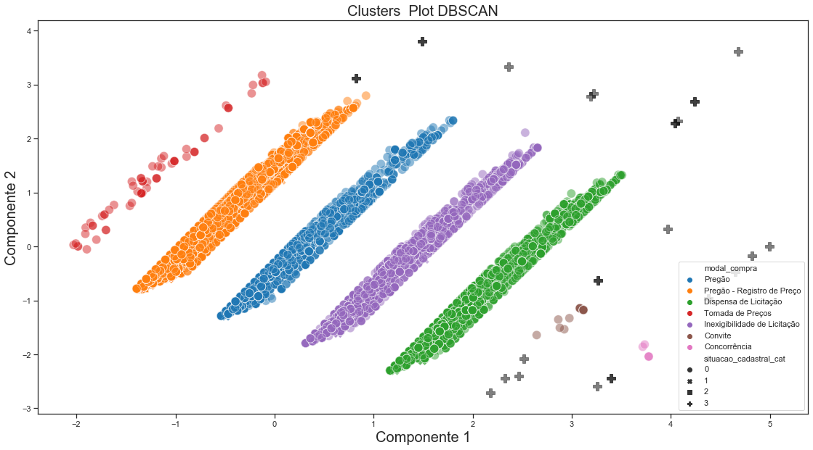

- Códigos disponíveis no arquivo *2-licitacoes_cnpj_agrupamento_todas_modalidades.ipynb*

-----------------------

### Analise por um tipo de Modalidade de Compra

Foi escolhido a modalidade com maior quantidade de amostras para prosseguimento das analise.

"Pregão - Registro de Preço"

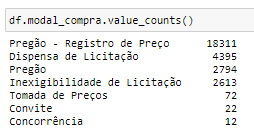

Após a execução do algoritmo DBSCAN foi encontrado este resultado.

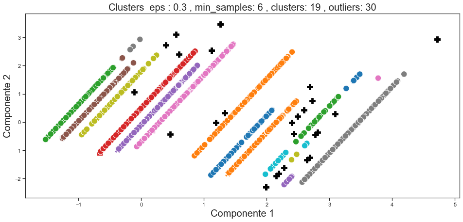

Foram necessárias várias re-execuções deste algorimo, como reparametrizações dos valores de eps e min-amostras, pois foi identificado uma possível melhoraria nos resultados ( menos clusters, menos outliers ) 
Inicialmente usamos um valor de eps muito baixo cujo resultado ficou bem ruim, com muitos clusters. 

#### Análise dos Resultados
Após esta etapa chegamos a esse resultado.

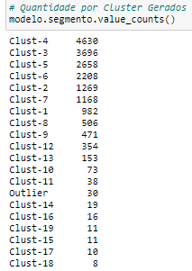

No gráfico plotado acima , vemos como os clusters ficaram bem definidos só com estas duas variáveis. 

Assim, pode ver como as segmentações foram criadas.

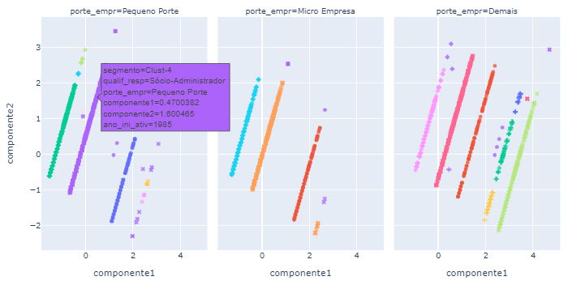

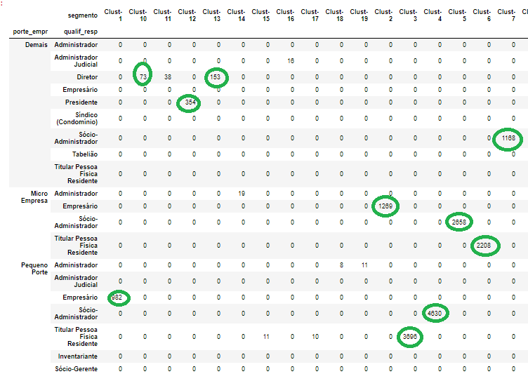

#### Outliers
Da mesma maneira da análise com dataset completo, os clusters gerados tem a mesma caracteristica como identificamos visualmente 
- A variável ‘ano inicio atividade’ foi um dos fatores de separação;
- Alguns clusters tem a mesma quantidade de amostras de pequenos outliers abaixo, será necessário algum ajuste fino no algoritmo para incluir alguns destes registros. 
    
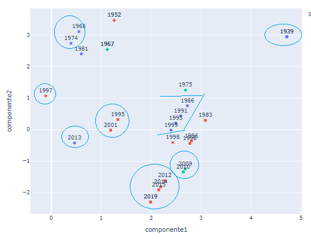

* Os códigos desta analise estão no arquivo *3-licitacoes_cnpj_agrupamento_por_modal_compra.ipynb*

-----------------------
### Conclusões Finais 
Identificados clusters atraves de similaridades por Modalidades de Compra.

Caso selecionamos outra modalidade ( ou adicionar outros filtros ) o resultado gerado pode ser diferente. Nestes casos sempre serão necessários a reparametrização diferente no DBSCAN.

Conseguimos demonstrar que a clusterização é viável com as variáveis disponíveis neste dataset publico e realizar a segmentação com as similaridades descobertas. 

Sempre que houver alguma necessidade adicional o algortimo pode ser reexecutado diversas vezes , com novos parametros para melhorar mais o resultado. Haverá um custo de processamento maior se a quantidade de amostras do dataset for maior e na quantidade de iterações necessárias para comparação dos resultados.
 
Ainda foi percebido que a análise pode ter continuidade, adicionando mais variáveis e um dataset maior para que possa melhorar a qualidade dos resultados e reduzindo outliers. Ainda posteriormente pode-se adicionar outros métodos supervisionados de análise para previsão com novas entradas de dados.

  
### Bibliografia

* Categorical encoding using Label-Encoding and One-Hot-Encoder. Disponível em (https://towardsdatascience.com/categorical-encoding-using-label-encoding-and-one-hot-encoder-911ef77fb5bd)
* DBSCAN Python Example: The Optimal Value For Epsilon (EPS). Disponível em (https://towardsdatascience.com/machine-learning-clustering-dbscan-determine-the-optimal-value-for-epsilon-eps-python-example-3100091cfbc)
* Géron, Aurélien. Hands-On Machine Learning with Scikit-Learn, Keras ,& TensorFlow. 2 Ed. 2019
* How and why to Standardize your data: A python tutorial. Disponível em (https://towardsdatascience.com/how-and-why-to-standardize-your-data-996926c2c832)
* How to Combine PCA and K-means Clustering in Python?. Disponível em (https://365datascience.com/tutorials/python-tutorials/pca-k-means/)
* O que é Licitação. Disponível em (https://portal.conlicitacao.com.br/o-que-e-licitacao/)
* Principal Component Analysis for Dimensionality Reduction in Python. Disponível em (https://machinelearningmastery.com/principal-components-analysis-for-dimensionality-reduction-in-python/)
* Provost, Foster; Fawcett, Tom. Data Science para négocios. 1 Ed. Rio de Janeiro. 2016.

### Dados 
* Dados Abertos. ( https://dados.gov.br/ )
* Portal da transparência. Disponível em (http://www.portaltransparencia.gov.br/download-de-dados/)
* Dados públicos de CNPJ. Disponível em ( https://www.receita.economia.gov.br/orientacao/tributaria/cadastros/cadastro-nacional-de-pessoas-juridicas-cnpj/dados-publicos-cnpj )

### Dicionario de Dados 
1. Tabela tb_amostra_cnpj

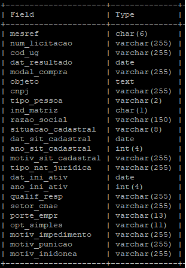

------------------

Matrícula: 191.007.477

Pontifícia Universidade Católica do Rio de Janeiro

Curso de Pós Graduação *Business Intelligence Master*

  
